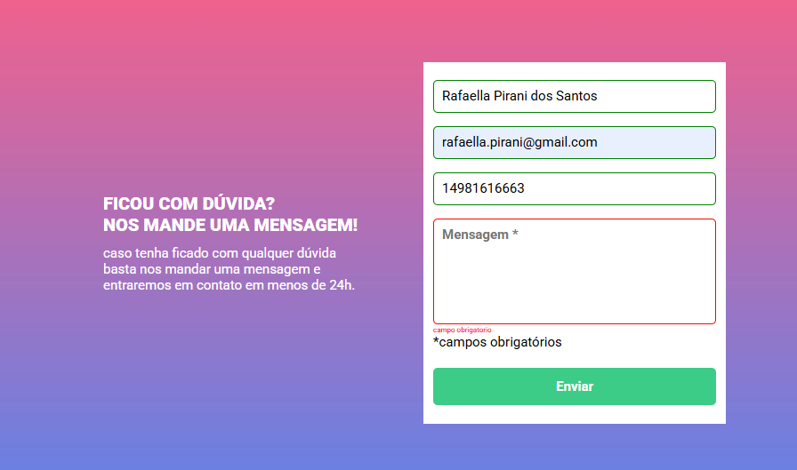

# 🧾 Validação de Formulários com JavaScript

## 💻 Sobre o projeto  
Este projeto tem como objetivo aplicar **validação de formulários utilizando JavaScript puro**, garantindo que nenhum campo seja enviado em branco e melhorando a **experiência do usuário** durante o preenchimento.  
A proposta é demonstrar boas práticas de manipulação do DOM, feedback visual em tempo real e controle de envio de dados.

---

## ⚙️ Tecnologias utilizadas  
- **HTML5** → estrutura e semântica da página  
- **CSS3** → estilização e feedback visual dos campos  
- **JavaScript (ES6+)** → validação e interatividade  

---

## 🧠 Funcionalidades principais  
✔️ Verifica se todos os campos obrigatórios foram preenchidos  
✔️ Adiciona **borda vermelha** e mensagem “campo obrigatório” nos campos inválidos  
✔️ Adiciona **borda verde** nos campos válidos  
✔️ Permite o envio do formulário apenas quando todos os campos estiverem corretos  

---

## 📸 Prévia do projeto  

  

---

## 🚀 Como visualizar  
Basta abrir o arquivo `index.html` em qualquer navegador moderno.  
Não há necessidade de instalação de dependências.

---

## 🧑‍💻 Autora  
**Rafaella Pirani**  
📍 Projeto desenvolvido para fins de estudo e aprimoramento em **JavaScript intermediário**.  
🔗 [GitHub](https://github.com/RafaellaPirani)  
🔗 [LinkedIn](https://www.linkedin.com/in/rafaella-pirani-03a735a7/)

---

✨ *"Aprender a validar é o primeiro passo para aprender a proteger."*
